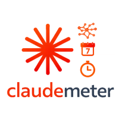
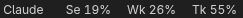
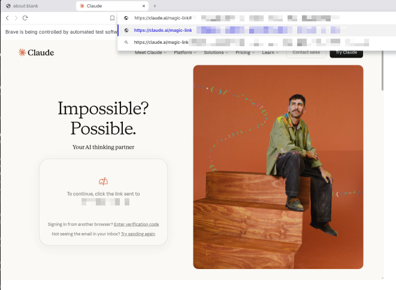
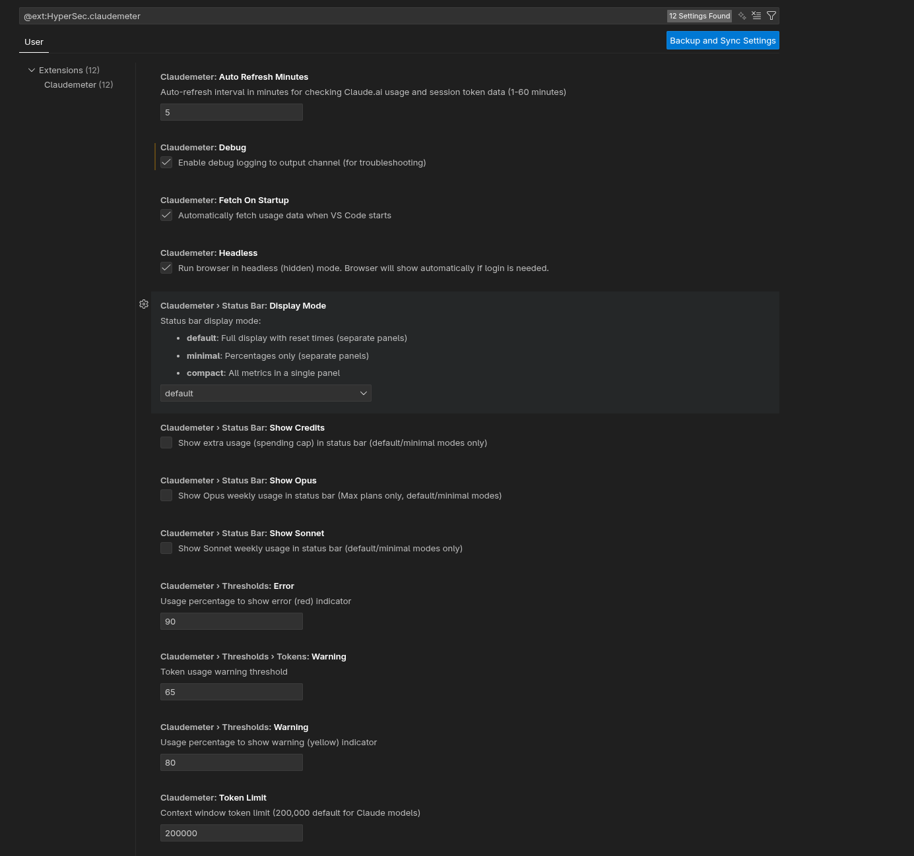

# Claudemeter

[](https://marketplace.visualstudio.com/items?itemName=HyperSec.claudemeter)
[](https://github.com/hypersec-io/claudemeter)
[](https://github.com/hypersec-io/claudemeter/issues)
[](https://github.com/hypersec-io/claudemeter)



> Monitor your Claude Code usage in real time, with full limit information.  
> *No more 'Surprise! You've hit your Claude Code weekly limit and it resets in 3 days you lucky, lucky person!'*

- Token context usage
- Session limits
- Weekly limits
- Limit consumption and reset times
- Claude session and login all local to device
- Open source https://github.com/hypersec-io/claudemeter  

## Startup


---

## Default Status Bar


## Minimal Status Bar



## Compact Status Bar


## Installation

### Prerequisites

- VS Code 1.80.0 or higher
- A Chromium-based browser (Chrome, Chromium, Brave, or Edge)

## First-Time Setup

The extension will **automatically fetch usage data** when VS Code starts. If you haven't logged in before:

1. A browser window will appear (the extension detected you need to log in)
2. Log in to Claude.ai with your credentials
3. Once logged in, the extension automatically fetches your usage data
4. Your session is saved locally - you won't need to log in again




## Configuration



Open VS Code Settings and search for "Claudemeter" to configure:

### `claudemeter.fetchOnStartup`

- **Type**: Boolean
- **Default**: `true`
- **Description**: Automatically fetch usage data when VS Code starts

### `claudemeter.headless`

- **Type**: Boolean
- **Default**: `true`
- **Description**: Run browser in headless (hidden) mode. Browser will show automatically if login is needed.

### `claudemeter.autoRefreshMinutes`

- **Type**: Number
- **Default**: `5`
- **Range**: `1-60` minutes
- **Description**: Auto-refresh interval in minutes

### `claudemeter.tokenLimit`

- **Type**: Number
- **Default**: `200000`
- **Range**: `1000-2000000`
- **Description**: Context window token limit used to calculate usage percentage

### `claudemeter.tokenOnlyMode`

- **Type**: Boolean
- **Default**: `false`
- **Description**: Token-only mode - only track Claude Code tokens, skip Claude.ai web usage scraping entirely

### `claudemeter.statusBar.displayMode`

- **Type**: String
- **Default**: `default`
- **Options**: `default`, `minimal`, `compact`
- **Description**: Status bar display mode:
  - **default**: Full display with reset times (separate panels)
  - **minimal**: Percentages only (separate panels)
  - **compact**: All metrics in a single panel

### `claudemeter.statusBar.showSonnet`

- **Type**: Boolean
- **Default**: `false`
- **Description**: Show Sonnet weekly usage in status bar (default/minimal modes only)

### `claudemeter.statusBar.showOpus`

- **Type**: Boolean
- **Default**: `false`
- **Description**: Show Opus weekly usage in status bar (Max plans only, default/minimal modes)

### `claudemeter.statusBar.showCredits`

- **Type**: Boolean
- **Default**: `false`
- **Description**: Show extra usage (spending cap) in status bar (default/minimal modes only)

### `claudemeter.debug`

- **Type**: Boolean
- **Default**: `false`
- **Description**: Enable debug logging to output channel (for troubleshooting)

### Threshold Configuration

Configure warning and error thresholds globally or per-gauge:

```json
{
  "claudemeter.thresholds.warning": 80,
  "claudemeter.thresholds.error": 90,
  "claudemeter.thresholds.tokens.warning": 65
}
```

## Commands

All commands are available via the Command Palette (`Ctrl+Shift+P` / `Cmd+Shift+P`):

- **`Claudemeter: Fetch Claude Usage Now`** - Manually fetch current usage data
- **`Claudemeter: Open Claude Settings Page`** - Open claude.ai/settings in your default browser
- **`Claudemeter: Start New Claude Code Session`** - Start a new token tracking session
- **`Claudemeter: Show Debug Output`** - Open debug output channel
- **`Claudemeter: Reset Browser Connection`** - Reset browser connection if stuck
- **`Claudemeter: Clear Browser Session (Re-login)`** - Force re-login
- **`Claudemeter: Open Browser for Login`** - Manually open browser for login

## Troubleshooting

### Browser won't launch

- Ensure you have enough disk space (~500MB for Chromium)
- Check that no antivirus is blocking Puppeteer
- Try running VS Code as administrator (Windows)

### Session expired or corrupted

- Delete the session folder:
  - macOS: `~/Library/Application Support/claudemeter/`
  - Linux: `~/.config/claudemeter/`
  - Windows: `%APPDATA%\claudemeter\`
- Log in again - session should persist this time

### Can't find usage data

- Claude.ai may have changed their settings page layout
- Check if you can see your usage at [claude.ai/settings](https://claude.ai/settings)
- [Report an issue](https://github.com/hypersec-io/claudemeter/issues) for the extension to be updated

## Privacy & Security

- **No credentials stored**: The extension never stores or transmits your credentials
- **Local session only**: Your authentication session is saved locally by Chromium
- **No data transmission**: Usage data stays on your machine
- **Open source**: All code is available for review

## Feedback & Issues

If you encounter any issues or have suggestions:

1. Check the troubleshooting section above
2. Review open issues on [GitHub](https://github.com/hypersec-io/claudemeter/issues)
3. Submit a new issue with:
   - VS Code version
   - Extension version
   - Error messages from the Output panel (View → Output → Claudemeter - Token Monitor)
   - Steps to reproduce

## Authors


Paying it forward by the hoopy froods at HyperSec
<https://hypersec.io>

## License

MIT License - See LICENSE file for details.

Originally inspired and based on [claude-usage-monitor](https://github.com/Gronsten/claude-usage-monitor) by Mark Campbell. If you find this useful, please consider [sponsoring the original author](https://github.com/sponsors/Gronsten).

---

**Note**: This is an unofficial extension and is not affiliated with Anthropic or Claude.ai.
