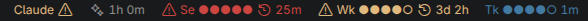

# Claudemeter

[](https://github.com/hyperi-io/claudemeter/issues)
[](https://github.com/hyperi-io/claudemeter)


> VSCode Extension. Monitor your Claude Code usage proactively in real time, with full limit information.
> *No more 'Surprise! You've hit your Claude Code weekly limit and it resets in 3 days you lucky, lucky person!'*
>
> Tracks session, weekly, token limits, context rot, claude platform status and happy hour across all Claude plans.


- Token context usage
- Session limits
- Weekly limits
- Limit consumption and reset times
- Claude service status (working, partial outage, major outage)
- Happy hour indicator — lights up during Anthropic's off-peak window
- Context rot indication
- Claude session and login all local to device
- Open source: <https://github.com/hyperi-io/claudemeter>

---

## Status Bar Default


## Status Bar All Warnings and Happy Hour



## Context Window Detection

Claudemeter automatically detects your context window size — no manual configuration needed.

Anthropic's March 2026 GA rollout made **1M context the default** for Max, Team, and Enterprise plans on Opus 4.6 and Sonnet 4.6 — no `[1m]` suffix required. Pro and Free plans stay at 200K unless a user explicitly picks a `[1m]`-suffixed alias or tops up via pay-as-you-go.

Because Claude Code strips the `[1m]` suffix from model IDs before writing them to session logs, and because Claude Code's own `s1mAccessCache` can go stale, claudemeter can't rely on any single source. Instead it uses a priority chain and labels the result honestly in the tooltip:

1. **User override** — `claudemeter.tokenLimit` setting, if set (authoritative)
2. **Explicit alias suffix** — `claudeCode.selectedModel: "opus[1m]"` (authoritative)
3. **JSONL suffix** — a model ID with `[Nm]` in session logs (authoritative, rare in practice)
4. **Live plan + model rule table** — `capabilities` from `/api/bootstrap` + model family from session logs matched against a data-driven rule table (e.g. `claude_max` + `opus-4.6+` → 1M)
5. **Local plan + model rule table** — same table, but plan comes from `.credentials.json subscriptionType` (used when the live API isn't available, e.g. `tokenOnlyMode`)
6. **Claude Code's `s1mAccessCache`** — used only as a last-resort corroborating signal, never as a negative
7. **Observed usage snap-to-tier** — if all authoritative signals fail but observed tokens exceed 200K, snap up to the next known tier (200K → 1M → 2M) and label the result as `(inferred)`
8. **Standard fallback** — 200K

The tooltip shows the source:

- `Context: 1.0M` — from an authoritative signal (user override, explicit alias, JSONL suffix)
- `Context: 1.0M (configured)` — from Claude Code's own eligibility cache
- `Context: 1.0M (inferred)` — from a rule-table match or observed-usage snap
- `Context: 200K` — standard fallback, no signal

The rule table is future-proof via numeric `minVersion` comparison — when Anthropic ships Opus 4.7 or 5.0 with the same defaults, the existing rules keep matching without a code change. To override auto-detection, set `claudemeter.tokenLimit` to a specific value.

## Why the context-rot meter exists

> The Tk gauge can turn **light blue at ~300K tokens used**, **dark blue
> at ~500K**, and **yellow / red as Claude approaches auto-compact** —
> *before* the existing yellow warning fires on a 200K-window account.
> These tiers exist because Claude's effective recall degrades long
> before the auto-compact trigger fires, and because the *meaning* of
> "X% used" changes dramatically with window size.

### What sparked this — Opus 4.7 (point-in-time snapshot, 2026-05)

> **Snapshot framing.** Claudemeter shipped the rot meter in direct
> response to the Opus 4.7 multi-needle regression. The *specific
> numbers below* will shift as model implementations improve, degrade,
> or change — the meter itself stays useful because the *phenomenon*
> (long-context quality degradation) is durable. Treat this section as
> the spark and the historical reason, not as live spec.

From Anthropic's own Opus 4.7 model card, MRCR v2 8-needle retrieval
*at the time of this enhancement (May 2026)*:

| Context size | 4.6   | 4.7   |
|--------------|-------|-------|
| 256K         | 91.9% | 59.2% |
| 1M           | 78.3% | 32.2% |

Multi-needle recall — the realistic case when you're juggling several
rules / files / constraints in one session — collapsed to roughly
**half** of the 4.6 value at 256K, and to a **third** of it at 1M.
Single-needle ("find this one thing") still scored ~89% at 1M on 4.7,
but that's not how most real work uses the model.

Anthropic's own model card conceded Opus 4.6 with 64k extended-thinking
dominates 4.7 on long-context multi-needle retrieval.

### What this means in practice

The failure mode users describe most consistently:

> "Claude does the right thing for the immediate ask but violates a
> rule from the original brief."

That happens *before* the existing yellow / red tiers fire. Light blue
(~300K tokens used) and dark blue (~500K) are the new advisory tiers
that flag this window — colour first, with a tooltip recommendation
pointing at `/compact` *on your terms*.

### How yellow / red defaults differ by account tier

The yellow and red Tk tiers are about one thing: **how much runway you
have before Claude compacts and drops its brain**. Auto-compact is
when Claude Code summarises the conversation to free up context;
everything that doesn't survive the summary is lost from the model's
working memory. You usually notice it as Claude suddenly forgetting a
rule from earlier in the session.

Auto-compact is **reserve-based**, not a fixed percentage. It fires
when only a small fixed number of tokens (~33K) remain in the window.
The visible percentage at which it fires therefore depends on the
window size:

| Window | Auto-compact at |
|--------|-----------------|
| 200K   | ~83%            |
| 1M     | ~96.7%          |

That's why Claudemeter uses **profile-based thresholds** keyed to your
detected Claude tier. Yellow and red defaults are expressed as
*runway in absolute tokens* (yellow = "~20K runway", red = "~5K
runway"), so they mean the same thing across window sizes:

| Window | Yellow fires at    | Red fires at       | Auto-compact at |
|--------|--------------------|--------------------|-----------------|
| 200K   | 147K used (~74%)   | 162K used (~81%)   | ~167K (~83%)    |
| 1M     | 947K used (~95%)   | 962K used (~96%)   | ~967K (~97%)    |

Red consistently means *"about 40K of runway left — Claude is about to
drop its brain, finish your thought."* Yellow means *"60-80K of
runway, still safe but heads-up."* On a 200K window each percentage
point is worth roughly 5× as much absolute runway as on 1M, which is
why the percentage thresholds differ so much between the two — but
the *meaning* (token runway to brain-loss) is identical.

The blue **rot** tiers (~300K / ~500K used) are about something
different — quality degradation in long-context multi-step work —
and apply only on tiers where that's a real phenomenon (Max, Team,
the 1M-context Max-on-Opus configurations). They're not auto-compact
warnings; they're "context is getting long enough that Claude's
recall is going to drift" warnings.

### Built-in profiles

Each Claude account tier resolves to a built-in threshold profile:

| Profile         | Detected by                              | Typical window   | Rot tiers |
|-----------------|------------------------------------------|------------------|-----------|
| `pro`           | `subscriptionType='pro'`                 | 200K             | off       |
| `max-5x`        | `rateLimitTier='default_claude_max_5x'`  | 1M Opus auto     | on        |
| `max-20x`       | `rateLimitTier='default_claude_max_20x'` | 1M Opus auto     | on        |
| `max-unknown`   | `subscriptionType='max'` alone           | 1M Opus auto     | on        |
| `team-standard` | `orgType='Team'`                         | 1M Opus auto     | on        |
| `enterprise`    | `orgType='Enterprise'`                   | 500K             | off*      |
| `unknown`       | fallback                                 | 200K (assumed)   | off       |

(* enterprise rot tiers ship off because 500K windows make 300K/500K
rot triggers unreachable — error fires first.)

### Customisation

- **Disable the rot meter entirely:** set `claudemeter.thresholds.tokens.rotEnabled = false` (per-profile, via the `profiles` override map).
- **Force a profile:** `claudemeter.thresholds.tokens.profileOverride = "max-20x"` etc.
- **Override individual thresholds:** edit `claudemeter.thresholds.tokens.profiles` deep-merge map. Example:

  ```json
  "claudemeter.thresholds.tokens.profiles": {
    "max-20x": {
      "thresholds": {
        "warningRunwayTokens": 30000
      }
    }
  }
  ```

- **Switch to monochrome (no threshold colouring):** `claudemeter.statusBar.colorMode = "basic"`.
- **Custom hex per tier:** `claudemeter.colors.{rotLight, rotDeep, warning, error, happyHour}`.

The rationale above stays in the README so users understand the
*why* even if they choose to switch the meter off.

## Happy Hour

Anthropic throttles Claude Code's 5-hour session window harder during their **peak hours** (Mon–Fri 05:00–23:00 America/Los_Angeles, per the 2026-03-26 announcement — see [claude-code#41788](https://github.com/anthropics/claude-code/issues/41788) / [#41930](https://github.com/anthropics/claude-code/issues/41930)). Outside that window — weekday overnight and all weekend — the session token allowance burns at its expected rate.

Claudemeter lights up a dedicated status-bar panel when you're in that off-peak window, with a countdown to when peak kicks back in:

```
Claude ✨ 4h 17m  Se ●●○○○ ⌚ 1h 28m  Wk ●●○○○ ⌚ 4d 17h  Tk ●○○○○ 1m
```

Default icon is VS Code's monochrome `$(sparkle)` codicon — it inherits the status-bar text colour so it doesn't stand out. Shown as `✨` above because GitHub-rendered markdown can't display VS Code codicons directly; the real panel renders as a small monochrome four-point star, not an emoji. You can swap it for a full-colour emoji (`🍺`, `🍹`, `☕`, etc.) via [`claudemeter.happyHour.icon`](#claudemeterhappyhouricon).

The panel disappears entirely during peak — no empty slot. The countdown respects [`claudemeter.statusBar.timeFormat`](#claudemeterstatusbartimeformat) (default `countdown` → `4h 17m`, or `12hour` / `24hour` for a clock time).

Window is LA-local so the icon lines up with Anthropic's infrastructure peak, regardless of your own timezone. Override via [`claudemeter.happyHour.peakWindow`](#claudemeterhappyhourpeakwindow) if policy changes before a claudemeter release ships. Choose a different icon (or disable the panel entirely) via [`claudemeter.happyHour.icon`](#claudemeterhappyhouricon) / [`claudemeter.happyHour.enabled`](#claudemeterhappyhourenabled).

## How It Works

Claudemeter v2 uses streamlined HTTP requests to fetch your usage data directly from Claude.ai's API endpoints. A browser is only needed once for the initial login — after that, your session cookie is stored locally and all subsequent fetches complete in 1-3 seconds with no browser overhead.

When you log in, the extension verifies that the browser account matches the account used by Claude Code CLI. If the accounts don't match, it will prompt you to log in with the correct account.

> **Why not use the Claude CLI's OAuth token?** The CLI's OAuth scopes (`user:inference`, `user:profile`, etc.) don't grant access to the usage/billing endpoints. Only the `sessionKey` cookie from a browser login works. If Anthropic ever expands the CLI scopes, the browser login could be eliminated entirely.

> **Why keep playwright-core?** The usage API endpoints are undocumented and could change without notice. `playwright-core` (shipped inside the VSIX, no bundled Chromium) drives the user's installed Chrome via the `executablePath` option for the initial login, and powers an opt-in legacy scraper fallback if the API breaks. See `claudemeter.useLegacyScraper` in settings. playwright-core has zero npm runtime dependencies, so there's no transitive-CVE surface to defend against.

## Installation

### Prerequisites

- VS Code 1.110.0 or higher
- A Chromium-based browser for login (Chrome, Chromium, Brave, Edge, Arc, Vivaldi, or Opera)

## First-Time Setup

1. On first launch, the extension prompts you to log in
2. Click **Log In Now** — a browser window opens to Claude.ai
3. Complete the Cloudflare verification ("Are you human?") if prompted
4. Log in with your credentials (Google, email, etc.)
5. The extension verifies the browser account matches your CLI account, saves the session cookie locally, and closes the browser
6. All future fetches use fast HTTP requests — no browser needed

When switching Claude Code accounts, the extension detects the change instantly via file watchers on `~/.claude/.credentials.json` and `~/.claude.json`, and prompts you to re-login. Switches between two personal accounts are detected via the account email and UUID (not just org UUID), so you won't be left looking at stale usage data. The login browser cache is cleared so you get a fresh login for the new account.

Multiple VS Code windows running claudemeter at the same time are safe — the session-data file is locked and atomically merged so concurrent writers don't clobber each other.

## Configuration

Open VS Code Settings and search for "Claudemeter" to configure:

### `claudemeter.fetchOnStartup`

- **Type**: Boolean
- **Default**: `true`
- **Description**: Automatically fetch usage data when VS Code starts

### `claudemeter.autoRefreshMinutes`

- **Type**: Number
- **Default**: `5`
- **Range**: `1-60` minutes
- **Description**: Auto-refresh interval in minutes for fetching Claude.ai usage data via HTTP. Each fetch takes 1-3 seconds with no browser overhead.

### `claudemeter.localRefreshSeconds`

- **Type**: Number
- **Default**: `10`
- **Range**: `5-60` seconds
- **Description**: Local token refresh interval in seconds. Controls how often local Claude Code token data is polled from JSONL files. This is a low-overhead local operation (no web requests). Set higher to reduce CPU usage.

### `claudemeter.tokenLimit`

- **Type**: Number
- **Default**: `0` (auto-detect)
- **Range**: `0-2000000`
- **Description**: Context window token limit override. Set to `0` (default) to auto-detect from Claude Code's model selection. Set manually to force a specific limit.

### `claudemeter.tokenOnlyMode`

- **Type**: Boolean
- **Default**: `false`
- **Description**: Token-only mode - only track Claude Code tokens, skip Claude.ai usage fetching entirely

### `claudemeter.useLegacyScraper`

- **Type**: Boolean
- **Default**: `false`
- **Description**: Use the legacy browser-based scraper instead of streamlined HTTP fetching. The default HTTP method calls undocumented Claude.ai API endpoints that could change without notice. Enable this fallback if the HTTP method stops working due to API changes. Requires a Chromium-based browser.

### `claudemeter.statusBar.displayMode`

- **Type**: String
- **Default**: `default`
- **Options**: `default`, `minimal`, `compact`
- **Description**: Status bar display mode:
  - **default**: Full display with reset times (separate panels)
  - **minimal**: Percentages only (separate panels)
  - **compact**: All metrics in a single panel

### `claudemeter.statusBar.showSonnet`

- **Type**: Boolean
- **Default**: `false`
- **Description**: Show Sonnet weekly usage in status bar (default/minimal modes only)

### `claudemeter.statusBar.showOpus`

- **Type**: Boolean
- **Default**: `false`
- **Description**: Show Opus weekly usage in status bar (Max plans only, default/minimal modes)

### `claudemeter.statusBar.showCredits`

- **Type**: Boolean
- **Default**: `false`
- **Description**: Show extra usage (spending cap) in status bar (default/minimal modes only)

### `claudemeter.statusBar.showServiceStatus`

- **Type**: Boolean
- **Default**: `true`
- **Description**: Show Claude service status indicator. Displays a warning/error icon if Claude services are degraded or experiencing an outage.

### `claudemeter.happyHour.enabled`

- **Type**: Boolean
- **Default**: `true`
- **Description**: Show the happy-hour status-bar panel during Anthropic's off-peak window. Set `false` to hide the panel entirely.

### `claudemeter.happyHour.icon`

- **Type**: String
- **Default**: `sparkle`
- **Options**: `sparkle`, `watch`, `zap`, `star`, `beer`, `cocktail`, `wine`, `champagne`, `martini`, `coffee`, `moon`, `sparkles`, `palm`, `party`, `custom`
- **Description**: Glyph to render in the happy-hour panel. The first four are monochrome VS Code codicons (inherit the status-bar text colour, stay unobtrusive). The rest are full-colour emoji. Choose `custom` and set `claudemeter.happyHour.customIcon` to use any glyph.

### `claudemeter.happyHour.customIcon`

- **Type**: String
- **Default**: `""`
- **Description**: Custom glyph for the happy-hour panel. Only used when `claudemeter.happyHour.icon` is `custom`. Accepts any emoji or `$(codicon-name)` syntax.

### `claudemeter.happyHour.peakWindow`

- **Type**: Object
- **Default**: `{ "days": [1,2,3,4,5], "start": "05:00", "end": "23:00", "tz": "America/Los_Angeles" }`
- **Description**: Anthropic's peak-throttling window. Happy hour appears **outside** this window. `days` are `0` (Sunday) through `6` (Saturday); `start` / `end` are `HH:MM` 24-hour format in the given IANA `tz`. Override if Anthropic changes the policy before a claudemeter release ships. Malformed fields fall back to defaults individually (e.g. a bad `tz` still keeps your custom `start` / `end`).

### `claudemeter.statusBar.timeFormat`

- **Type**: String
- **Default**: `countdown`
- **Options**: `12hour`, `24hour`, `countdown`
- **Description**: How to display reset times in the status bar:
  - **12hour**: 12-hour format with AM/PM (e.g., 2:30 PM)
  - **24hour**: 24-hour format (e.g., 14:30)
  - **countdown**: Countdown timer (e.g., 2h 15m)

### `claudemeter.statusBar.usageFormat`

- **Type**: String
- **Default**: `barCircle` on macOS/Linux, `barLight` on Windows (platform-aware — Windows status-bar fonts often lack the Geometric Shapes glyphs `barCircle` uses, so the default falls back to Block Elements which render reliably). Any explicit user setting overrides the platform default.
- **Options**: `percent`, `barLight`, `barSolid`, `barSquare`, `barCircle`
- **Description**: How to display usage values in the status bar:
  - **percent**: Percentage (e.g., 60%)
  - **barLight**: Light blocks (e.g., ▓▓▓░░) — universal default for Windows
  - **barSolid**: Solid blocks (e.g., ███░░)
  - **barSquare**: Squares (e.g., ■■■□□)
  - **barCircle**: Circles (e.g., ●●●○○) — default on macOS/Linux

If your chosen style renders unevenly (mismatched cell widths), pick `barLight` or `barSolid` — Block Elements are the most font-portable option across all three platforms.

### `claudemeter.statusBar.tokensDisplay`

- **Type**: String
- **Default**: `limit` (new in 2.3.3 — previously `both`, auto-migrated to `extended`)
- **Options**: `bar`, `value`, `extended`, `limit`, `count`
- **Description**: Controls the **Tk** (token usage) indicator:
  - **bar**: progress bar / percentage only — `Tk ●●○○○`
  - **value**: bar + current consumption — `Tk ●●○○○ 518k`
  - **extended**: bar + current/max — `Tk ●●○○○ 518k/1m` (same rendering as the pre-2.3.3 `both` default)
  - **limit** _(default)_: bar + max, shown only when greater than the 200K standard context window — `Tk ●●○○○ 1m` on a 1M session; just the bar on a 200K session
  - **count**: token count only, no bar — `Tk 518k/1m`
- The max is suppressed when the context window limit is inferred rather than authoritative, so the display doesn't misrepresent an uncertain value.
- The existing `claudemeter.statusBar.usageFormat` setting still controls the bar/percent half.
- **Migration**: existing configs with `tokensDisplay: both` are auto-rewritten to `extended` on startup; no visible change for those users.

### `claudemeter.statusBar.alignment`

- **Type**: String
- **Default**: `right`
- **Options**: `left`, `right`
- **Description**: Status bar alignment. Requires window reload to take effect.

### `claudemeter.statusBar.priority`

- **Type**: Number
- **Default**: `100`
- **Range**: `0-10000`
- **Description**: Status bar priority (higher values position items closer to the centre). Requires window reload to take effect.

### `claudemeter.debug`

- **Type**: Boolean
- **Default**: `false`
- **Description**: Enable debug logging to output channel (for troubleshooting)

### `claudemeter.debugLogFile`

- **Type**: String
- **Default**: Auto-populated on first run (`~/.config/claudemeter/debug.log` or platform equivalent)
- **Description**: Path to debug log file. Supports `~` for home directory.

### `claudemeter.debugLogMaxSizeKB`

- **Type**: Number
- **Default**: `256`
- **Range**: `64-2048` KB
- **Description**: Maximum debug log file size in KB. Oldest entries are trimmed when exceeded.

### `claudemeter.thresholds.warning`

- **Type**: Number
- **Default**: `80`
- **Range**: `1-100`
- **Description**: Usage percentage to show warning (yellow) indicator

### `claudemeter.thresholds.error`

- **Type**: Number
- **Default**: `90`
- **Range**: `1-100`
- **Description**: Usage percentage to show error (red) indicator

### `claudemeter.thresholds.tokens.warning`

- **Type**: Number
- **Default**: `65`
- **Range**: `0-100`
- **Description**: Token-gauge warning (yellow) threshold as a percentage. Default `65` tracks Claude Code's auto-compact trigger (~83% of the context window) minus ~20, giving roughly 20 percentage points of warning runway before auto-compact. `0` inherits `claudemeter.thresholds.warning`. **Deprecated for profile-based accounts:** the profile system expresses this as `warningRunwayTokens` (absolute tokens before auto-compact) — use `claudemeter.thresholds.tokens.profiles` to override.

### `claudemeter.thresholds.tokens.error`

- **Type**: Number
- **Default**: `75`
- **Range**: `0-100`
- **Description**: Token-gauge error (red) threshold as a percentage. Default `75` gives roughly 10 percentage points of red runway before auto-compact fires (~83%). `0` inherits `claudemeter.thresholds.error`. **Deprecated for profile-based accounts:** use `claudemeter.thresholds.tokens.profiles` to override `errorRunwayTokens` instead.

### `claudemeter.statusBar.colorMode`

- **Type**: String
- **Default**: `color`
- **Options**: `color`, `basic`
- **Description**: Status-bar decoration mode.
  - **color** (default): full palette — gauge tiers (rotLight, rotDeep, warning, error), Se/Wk warning icons, happy-hour green, and the colour-coded `●` prefix in the tooltip.
  - **basic**: every gauge renders in default foreground; no icons; no tier tints; no tooltip prefix dots; no rot recommendation sub-lines. Tooltip section structure is preserved either way.

### `claudemeter.thresholds.tokens.profileOverride`

- **Type**: String
- **Default**: `""` (auto-detect)
- **Description**: Force a specific Tk threshold profile by name. Empty (default) auto-detects from your Claude account signals. Built-in profile names: `pro`, `max-5x`, `max-20x`, `max-unknown`, `team-standard`, `enterprise`, `unknown`. See [Built-in profiles](#built-in-profiles) for what each profile enables.

### `claudemeter.thresholds.tokens.profiles`

- **Type**: Object
- **Default**: `{}`
- **Description**: Per-profile threshold overrides (deep-merge semantics — leaf fields merge over the built-in profile; unset fields inherit from the built-in). Example overriding only the warning runway for `max-20x`:

  ```json
  "claudemeter.thresholds.tokens.profiles": {
    "max-20x": {
      "thresholds": {
        "warningRunwayTokens": 30000
      }
    }
  }
  ```

### `claudemeter.colors.rotLight`

- **Type**: String (hex colour or `""`)
- **Default**: `""` (inherits theme colour `claudemeter.rotLight`)
- **Description**: Custom hex (e.g. `#6ca0c4`) overriding the light-blue rot tier colour. Theme-agnostic — applies to both the status bar and tooltip.

### `claudemeter.colors.rotDeep`

- **Type**: String (hex colour or `""`)
- **Default**: `""` (inherits theme colour `claudemeter.rotDeep`)
- **Description**: Custom hex overriding the dark-blue deep-rot tier colour. Theme-agnostic.

### `claudemeter.colors.warning`

- **Type**: String (hex colour or `""`)
- **Default**: `""` (inherits `charts.yellow`)
- **Description**: Custom hex overriding the warning (yellow) tier colour.

### `claudemeter.colors.error`

- **Type**: String (hex colour or `""`)
- **Default**: `""` (inherits `claudemeter.outageRed`)
- **Description**: Custom hex overriding the error (red) tier colour.

### `claudemeter.colors.happyHour`

- **Type**: String (hex colour or `""`)
- **Default**: `""` (inherits `claudemeter.happyHourGreen`)
- **Description**: Custom hex overriding the happy-hour panel colour.

## Commands

All commands are available via the Command Palette (`Ctrl+Shift+P` / `Cmd+Shift+P`):

- **`Claudemeter: Fetch Claude Usage Now`** - Manually fetch current usage data
- **`Claudemeter: Open Claude Settings Page`** - Open claude.ai/settings in your default browser
- **`Claudemeter: Start New Claude Code Session`** - Start a new token tracking session
- **`Claudemeter: Show Debug Output`** - Open debug output channel
- **`Claudemeter: Login to Claude.ai`** - Open browser for login
- **`Claudemeter: Clear Session (Re-login)`** - Clear saved session and force re-login
- **`Claudemeter: Resync Account (after /login switch)`** - Force a re-read of Claude Code credentials and refresh usage (useful if an account switch wasn't detected automatically)
- **`Claudemeter: Dump State (for bug reports)`** - Print a redacted snapshot of current state (identity, resolved org, cache, live sessions) to an output channel — attach this to issues to speed up diagnosis
- **`Claudemeter: Reset Browser Connection (Legacy)`** - Reset browser connection (legacy scraper mode only)

## Troubleshooting

### Browser won't open for login

- Ensure you have a Chromium-based browser installed (Chrome, Edge, Brave, etc.)
- The extension auto-detects your default browser; if it's not Chromium-based (e.g., Firefox), install Chrome or Edge
- Try running VS Code as administrator (Windows)

### Login appears stuck or never completes

The spawned Chrome instance is isolated from your normal browser, so a few login paths can break:

- **Email confirmation links land in a different browser** -- when you click "Confirm" in claude.ai's verification email, your OS opens the link in your default browser, not in the Chrome instance we spawned.
- **SSO popouts open in separate windows** -- Google / GitHub / Okta redirects can land outside our spawned context.
- **Password manager refuses to autofill** -- managers typically only autofill into the browser instance they were installed in.

When the login-timed-out toast appears, click **Try cookie paste (advanced)**. That opens claude.ai in your default browser (where the above just works), then takes the `sessionKey` cookie via DevTools (Application > Cookies > https://claude.ai) and a VS Code input box. Requires DevTools.

### Session expired or fetch errors

- Run **Claudemeter: Clear Session (Re-login)** from the Command Palette
- Or manually delete the session cookie file:
  - macOS: `~/Library/Application Support/claudemeter/session-cookie.json`
  - Linux: `~/.config/claudemeter/session-cookie.json`
  - Windows: `%APPDATA%\claudemeter\session-cookie.json`

### API changes broke usage fetching

- Claude.ai's usage API endpoints are undocumented and may change without notice
- Try enabling the legacy scraper: set `claudemeter.useLegacyScraper` to `true` in settings
- Check if you can see your usage at [claude.ai/settings](https://claude.ai/settings)
- [Report an issue](https://github.com/hyperi-io/claudemeter/issues) so the extension can be updated

### Wrong account after login

- If the extension detects the browser account doesn't match the CLI account, it will prompt you to log in again with the correct account
- Run **Claudemeter: Clear Session (Re-login)** if the issue persists

## Privacy & Security

- **No credentials stored**: The extension never stores or transmits your login credentials
- **Local session cookie**: Your `sessionKey` cookie is saved locally at `~/.config/claudemeter/session-cookie.json` (or platform equivalent) and is only sent to `claude.ai`
- **No data transmission**: Usage data stays on your machine
- **Self-contained**: `playwright-core` ships inside the VSIX as its own package directory (required so its runtime asset loading resolves correctly). It uses your existing system browser for login only — no Chromium is downloaded or bundled.
- **Minimal attack surface**: playwright-core has zero npm runtime dependencies — its driver is a self-contained native binary. No proxy-agent chain, no FTP client, no transitive-CVE surface.
- **Account verification**: The extension verifies the browser login matches the CLI account before saving the session
- **Open source**: All code is available for review

## Feedback & Issues

If you encounter any issues or have suggestions:

1. Check the troubleshooting section above
2. Review open issues on [GitHub](https://github.com/hyperi-io/claudemeter/issues)
3. Submit a new issue with:
   - VS Code version
   - Extension version
   - Error messages from the Output panel (View > Output > Claudemeter - Token Monitor)
   - Steps to reproduce

## Authors


Paying it forward by the hoopy froods at HyperI (formerly HyperSec)
<https://hyperi.io>

## Development

### HyperI AI Tooling (Internal)

This repo includes an optional `hyperi-ai/` submodule containing the HyperI AI assistant standards and coding conventions. It's a private repo — external contributors can safely ignore it. Clones work normally without the submodule.

**HyperI devs — first-time setup:**

```bash
git submodule update --init hyperi-ai
./hyperi-ai/attach.sh --agent claude
```

**Update to latest:**

```bash
git submodule update --remote hyperi-ai
./hyperi-ai/attach.sh --agent claude
```

## License

MIT License - See LICENSE file for details.

Originally inspired and based on [claude-usage-monitor](https://github.com/Gronsten/claude-usage-monitor) by Mark Campbell.

---

**Note**: This is an unofficial extension and is not affiliated with Anthropic or Claude.ai.
